# Aussie Agents - Architecture Diagrams

## System Architecture Overview

```mermaid
graph TB
    subgraph Frontend["React 19 Frontend"]
        UI[User Interface Layer]
        Components[Component Layer]
        Hooks[Custom Hooks Layer]
        API[API Client Layer]
    end
    
    subgraph Backend["Flask Backend"]
        Routes[API Routes]
        Handlers[API Handlers]
        Agent[Agent Core]
        DB[(Database)]
    end
    
    UI --> Components
    Components --> Hooks
    Hooks --> API
    API -->|HTTP/Long-Poll| Routes
    Routes --> Handlers
    Handlers --> Agent
    Agent --> DB
    
    style Frontend fill:#1a1a2e
    style Backend fill:#16213e
    style UI fill:#34d399
    style API fill:#34d399
```

## Component Architecture

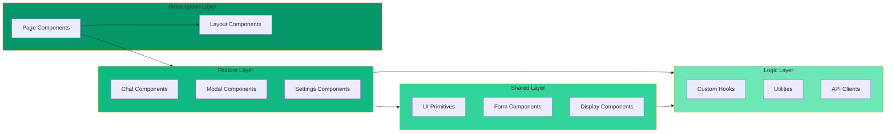

## Data Flow Architecture

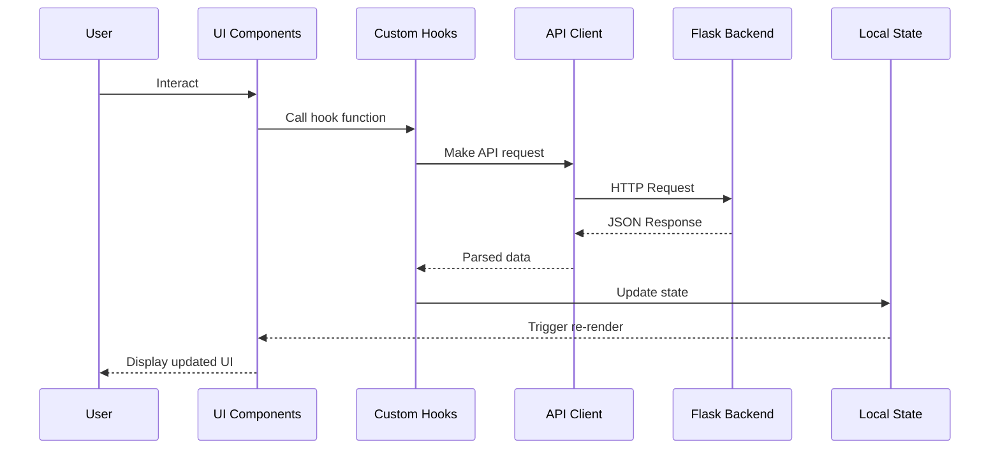

## State Management Flow

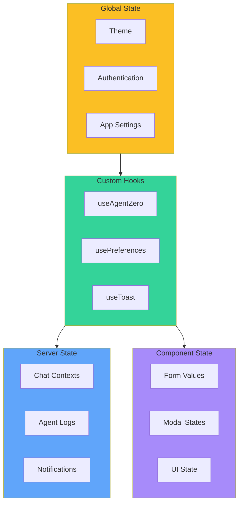

## Refactoring Workflow

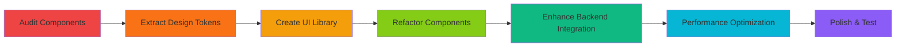

## CSS Design System Hierarchy

```mermaid
graph TB
    Root[CSS Custom Properties]
    
    Root --> Primitives[Primitives]
    Root --> Semantic[Semantic Tokens]
    Root --> Component[Component Tokens]
    
    Primitives --> Colors[Colors]
    Primitives --> Spacing[Spacing Scale]
    Primitives --> Typography[Typography]
    Primitives --> Radius[Border Radius]
    
    Semantic --> Primary[Primary Actions]
    Semantic --> Success[Success States]
    Semantic --> Error[Error States]
    Semantic --> Warning[Warning States]
    
    Component --> Button[Button Variants]
    Component --> Input[Input Styles]
    Component --> Modal[Modal Styles]
    Component --> Card[Card Styles]
    
    style Root fill:#1f2937
    style Primitives fill:#374151
    style Semantic fill:#4b5563
    style Component fill:#6b7280
```

## Performance Optimization Strategy

```mermaid
graph LR
    subgraph Initial["Initial Load"]
        CodeSplit[Code Splitting]
        TreeShake[Tree Shaking]
        Compression[Compression]
    end
    
    subgraph Runtime["Runtime"]
        Memo[Memoization]
        Virtual[Virtual Lists]
        Lazy[Lazy Loading]
    end
    
    subgraph Network["Network"]
        Cache[API Caching]
        Retry[Retry Logic]
        Prefetch[Prefetching]
    end
    
    subgraph Backend["Backend"]
        DBCache[DB Caching]
        Query[Query Optimization]
        Compress[Response Compression]
    end
    
    Initial --> Runtime
    Runtime --> Network
    Network --> Backend
    
    style Initial fill:#dc2626
    style Runtime fill:#ea580c
    style Network fill:#16a34a
    style Backend fill:#2563eb
```

## Component Dependency Graph

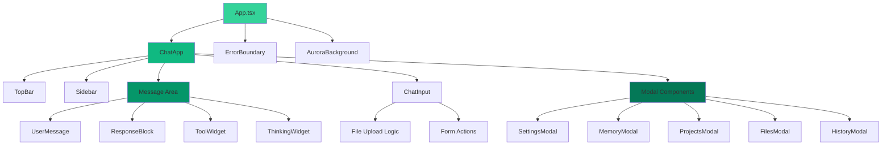

## API Integration Architecture

```mermaid
graph LR
    subgraph Frontend["Frontend API Layer"]
        AgentAPI[agentZeroApi.ts]
        BaseAPI[api.ts]
        Types[types.ts]
    end
    
    subgraph Backend["Backend Routes"]
        Poll[/poll]
        Message[/message_async]
        Settings[/settings_*]
        Projects[/projects]
        Memory[/memory_dashboard]
        Files[/upload_work_dir_files]
    end
    
    subgraph Missing["Missing Integrations"]
        Transcribe[/transcribe]
        Synthesize[/synthesize]
        Knowledge[/knowledge_*]
        Subagents[/subagents]
        ContextWindow[/ctx_window_get]
    end
    
    AgentAPI --> Poll
    AgentAPI --> Message
    AgentAPI --> Settings
    AgentAPI --> Projects
    AgentAPI --> Memory
    AgentAPI --> Files
    
    Missing -.->|To Implement| AgentAPI
    
    BaseAPI --> AgentAPI
    Types --> AgentAPI
    
    style Frontend fill:#3b82f6
    style Backend fill:#10b981
    style Missing fill:#ef4444
```

## Testing Strategy

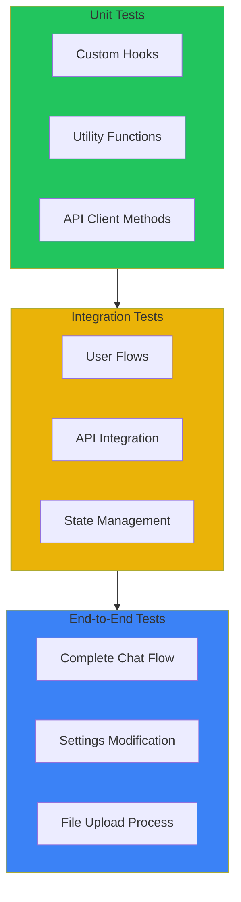

## Accessibility Implementation

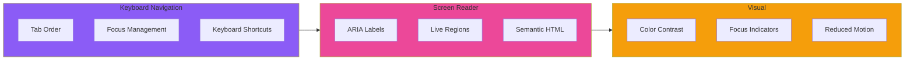

## Deployment Pipeline

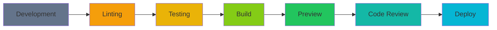

---

## Legend

### Component Types
- **Presentation**: User-facing page components
- **Feature**: Domain-specific feature modules
- **Shared**: Reusable UI components
- **Logic**: Business logic and utilities

### State Types
- **Global State**: Application-wide state
- **Server State**: Data fetched from backend
- **Local State**: Component-specific state
- **Derived State**: Computed from other state

### Priority Levels
- 🔴 High Priority: Critical for MVP
- 🟡 Medium Priority: Important for UX
- 🟢 Low Priority: Nice to have features
